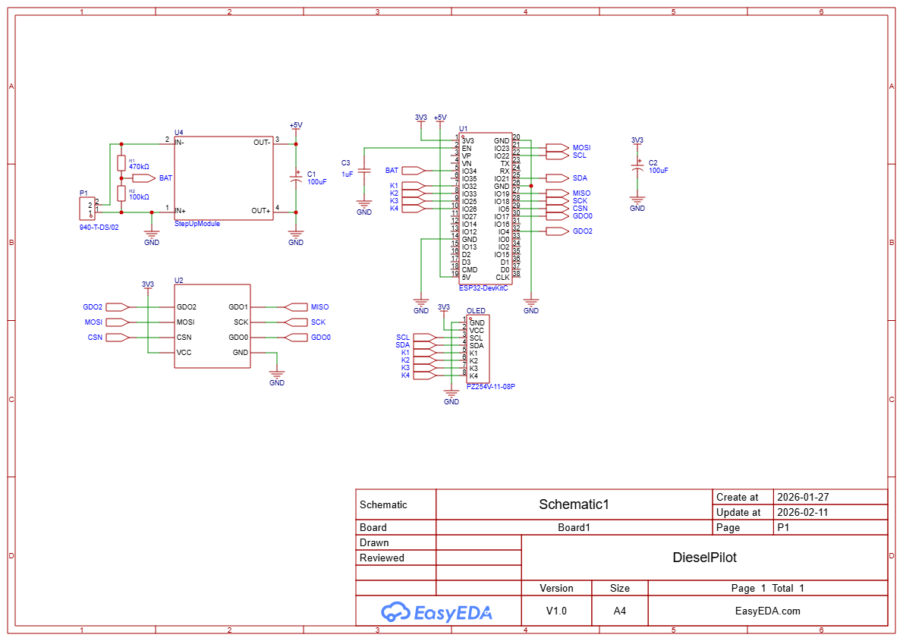
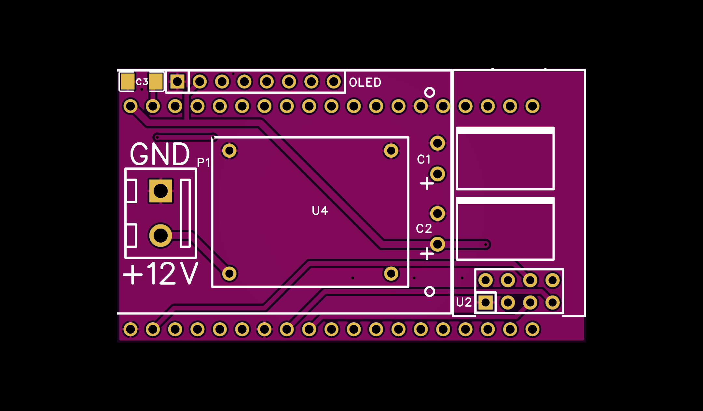
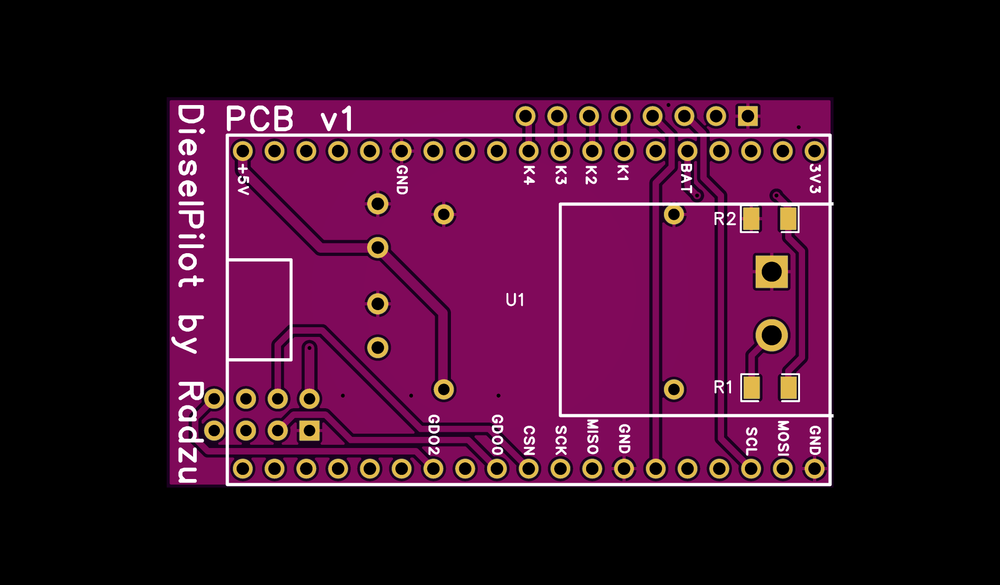

## Overview

I designed a board that allows you to connect all the components required to build the device.

## Bill of Materials

| Item | Description | Variant | Link |
|------|-------------|---------|------|
| 1 | DC-DC 3A Buck Step-down Power Supply Module | 5 V | [AliExpress](https://pl.aliexpress.com/item/1005003564766694.html) |
| 2 | ESP32 Development Board | ESP32‑WROOM‑32D, Type‑C | [AliExpress](https://www.aliexpress.com/item/1005006233889970.html) |
| 3 | TENSTAR CC1101 433 MHz Wireless Module | – | [AliExpress](https://pl.aliexpress.com/item/1005009890417155.html) |
| 4 | 0.96" OLED Display with 4x4 key, SSD1315 | – | [AliExpress](https://pl.aliexpress.com/item/1005008995077781.html) |
| 5 | Aluminum Electrolytic Capacitor | 16 V, 100 µF | [AliExpress](https://pl.aliexpress.com/item/1005002524973878.html) |
| 6 | PCB Terminal Block Connector, 5.0 mm pitch | 2‑pin | [AliExpress](https://pl.aliexpress.com/item/1005006642865467.html) |
| 7 | Gold Pin Female Header Strip | 1×50P, female | [AliExpress](https://pl.aliexpress.com/item/1005006830921802.html) |

### Optional components

| Item | Description | Package | Value |
|------|-------------|---------|-------|
| 8 | Resistor SMD | 1206 | 100 kΩ |
| 9 | Resistor SMD | 1206 | 470 kΩ |

## Schematic

## Board

## Hardware files
- [`Gerber_PCB1_2026-02-11.zip`](Gerber_PCB1_2026-02-11.zip)

